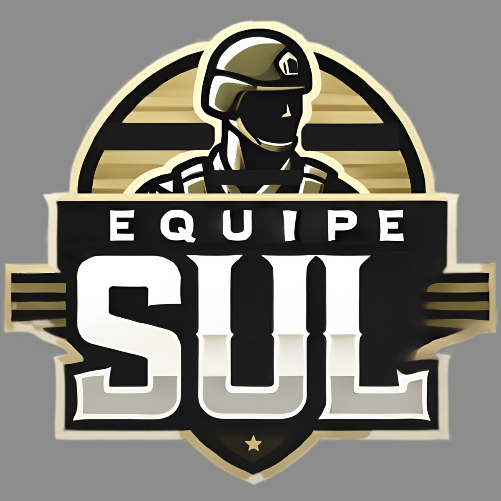
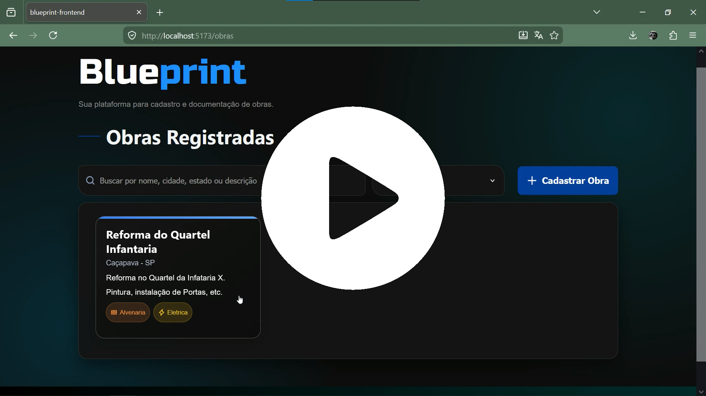

# ESUL - API ADS 4º Semestre
# Blueprint

<p align="center">
      
      <h2 align="center">Equipe SUL</h2>
</p>

<p align="center">
  | <a href ="#desafio"> Desafio</a>  |
  <a href ="#solucao"> Solução</a>  |   
  <a href ="#tecnologias">Tecnologias</a> |
  <a href ="#backlog"> Backlog do Produto</a>  |
  <a href ="#dor">DoR</a>  |
  <a href ="#dod">DoD</a>  |
  <a href ="#sprint"> Cronograma de Sprints</a>  |
  <a href ="#manual">Manual de Instalação</a>  | 
  <a href ="#equipe"> Equipe</a> |
</p>

> Status do Projeto: Em Desenvolvimento 🛠
>
# Video do Projeto - v1 📽️

[](https://youtu.be/mwXvDLRzjOo?si=rIoOHfjssDcdg8Sf)


## 🏅 Desafio Apresentado<a id="desafio"></a>
O Exército Brasileiro é obrigado a produzir documentações técnicas detalhadas — memoriais de cálculo, especificações e orçamentos — para licenciar obras, seguindo normas da ABNT e padrões internos. Para que assim possa fazer uma licitação — processo formal e burocrático de contratação empresas para execução do serviço. Todo esse processo de documentação técnica é feito manualmente pelos engenheiros, desde a interpretação dos arquivos CAD até a formatação dos documentos, consumindo horas de trabalho especializado, atrasando aprovações e desviando o foco de atividades mais estratégicas.

## 🏅 Solução Proposta <a id="solucao"></a>
Uma aplicação web que recebe arquivos de obra (CAD, CSV ou Excel), usa inteligência artificial para extrair e interpretar os quantitativos, e gera automaticamente os documentos técnicos padronizados — memoriais de cálculo, especificações e orçamentos — prontos para uso pelo Exército.

## 💻 Tecnologias <a id="tecnologias"></a>
<h4 align="center">
      
      
      
      
      
      
      
      
      
      
      
      
      
      
</h4>

---

## 📋 Backlog do Produto <a id="backlog"></a>

| Rank | Prioridade | User Story                                                                                                                                                                    | Story Points | Sprint | Requisito | Status |
| :--: | :--------: | :---------------------------------------------------------------------------------------------------------------------------------------------------------------------------- | :----------: | :----: | :-------: | :----: |
|   1  |    Alta    | Como Engenheiro, quero fazer upload da planilha de extração do CAD (CSV/Excel), para que o sistema receba os quantitativos.                                                   |       5      |    1   |   REQ-01   |    ✅   |
|   2  |    Média   | Como sistema, quero validar a estrutura do arquivo enviado, para que dados incompletos não quebrem o processamento.                                                           |       3      |    1   |   REQ-02   |    ✅   |
|   3  |    Alta    | Como sistema, quero mapear os nomes do CAD com a Base Oficial ("De-Para"), para que os itens fiquem padronizados.                                                             |       9      |    1   |   REQ-03   |    ✅   |
|   4  |    Alta    | Como Engenheiro, quero revisar as correspondências sugeridas pelo sistema e aplicar margens de perda por item, para que o orçamento final reflita a realidade física da obra. |       5      |    1   |   REQ-04   |    ✅   |
|   5  |    Baixa   | Como Engenheiro, quero ver um painel com a lista das minhas obras, para que eu possa abrir projetos ou atualizá-los.                                                          |       3      |    1   |   REQ-15  |    ✅   |
|   6  |    Baixa   | Como engenheiro, quero cadastrar uma nova obra informando nome e estado, para que eu possa verificar, organizar arquivos e ver materiais por projeto.                         |       3      |    1   |   REQ-16  |    ✅   |
|  7  |    Baixa   | Como Engenheiro, quero exportar o memorial aprovado em PDF/DOCX, para que eu gere o backup oficial do projeto.                                                                |       3      |    2   |   REQ-08   |    ✅   |
|  8  |    Alta   | Como administrador, quero que a IA receba contextos e direcionamentos específicos, para que os dados coletados sejam mais confiáveis e consequentemente mais impactantes no produto.                                                        |       8      |    2   |   REQ-17   |    ✅   |
|  9  |    Alta   | Como administrador, quero confirmar se as informações retiradas pelas linguagens estão compativeis com a tabela sinapi, para que o orçamento possa ser gerado de forma efetiva.                                                                   |       8      |    2   |   REQ-18   |    ✅   |
|  10  |    Alta   | Como Engenheiro, quero ter confiabilidade nas informações apresentadas, para que possa fazer uma verificação mais rápida no momento de edição de documentos                                                          |       13      |    2   |   REQ-19   |    ✅   |
|  11  |    Alta   | Como administrador, quero que o backend faça o calculo quantitativo de materiais,  para que o memorial orçamentário seja montado de forma fluida.                                                                           |       8      |    2   |   REQ-20   |    ✅   |

---

## 🏃‍ DoR - Definition of Ready <a id="dor"></a>
- **Descrição clara:** A user story está escrita de forma compreensível.
- **Critérios de aceitação definidos:** Cada US tem tasks com critérios testáveis (como você já fez).
- **Dependências identificadas:** Não existem bloqueios externos (tecnologia, banco de dados, etc.) sem solução.
- **Estimativa feita:** Pontos de esforço foram atribuídos
- **Prioridade definida:** O valor de negócio está claro para a equipe.
- **Material de referência disponível:** Qualquer documento extra necessário (ex.: PDF, telas, explicação do fluxo...) está disponível.

## 🏆 DoD - Definition of Done <a id="dod"></a>
- Funcionalidade implementada
- Critérios de aceitação atendidos
- Testes unitários executados e aprovados (apenas back-end)
- Integração ao projeto por meio de pull request
- Validação do PO ou Scrum Master
- Atualização da documentação 

---

## 📅 Cronograma de Sprints <a id="sprint"></a>

| Sprint | Período | Documentação |
| :--- | :-----------: | :--- |
| 🔖 **SPRINT 1** | 16/03 - 05/04 | [Sprint 1 Docs](./docs/sprint1/) |
| 🔖 **SPRINT 2** | 13/04 - 03/05 | [Sprint 2 Docs](./docs/sprint2/) |
| 🔖 **SPRINT 3** | 11/05 - 31/05 | [Sprint 2 Docs](./link/sprint3/) |


---

## 📖 Manual de Instalação <a id="manual"></a>
### 🛠 Pré-requisitos
* Git, Node.js, Python...

### 1. Instalação
```bash
procedimento de clonagem, instalação e etc...
```

## 🎓 Equipe <a id="equipe"></a>

| Função         | Nome             | GitHub | LinkedIn |
| :-------------- | :---------------- | :------ | :-------- |
| Product Owner  | Rodolfo Corbalan | [](https://github.com/xRod-Rodriguesx) | [](https://www.linkedin.com/in/rodolfo-corbalan-2a02b4207) |
| Scrum Master   | João Álvaro      | [](https://github.com/JoaoAlv4ro) | [](https://www.linkedin.com/in/joaoalv4ro) |
| Desenvolvedor  | Celso Moreira    | [](https://github.com/yCels) | [](https://www.linkedin.com/in/celso-moreira-freitas-957832222) |
| Desenvolvedor  | Leo Naito        | [](https://github.com/LNaito) |  |
| Desenvolvedor  | Raul Germano     | [](https://github.com/Raul-Germano-Rosendo) | [](https://www.linkedin.com/in/raul-germano-rod/) |
| Desenvolvedor  | Uanderson Leonardo | [](https://github.com/uandleon) | [](https://www.linkedin.com/in/uanderson-leonardo-1aaa722a0/) |
| Desenvolvedor  | Vivian Santos    | [](https://github.com/vivianSantos0101) | [](https://www.linkedin.com/in/vivianstoliveira) |
